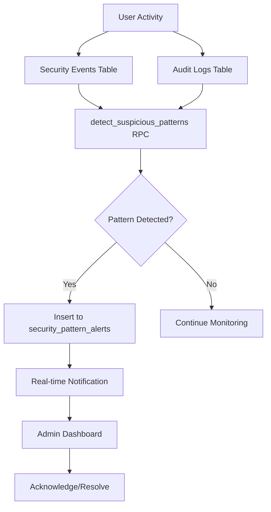

# Column-Level Security & Pattern Detection Implementation

## Overview
Implemented comprehensive column-level security for sensitive profile fields and real-time security pattern detection system to monitor suspicious activities across audit logs and security events.

## 1. Column-Level Security for Profiles

### Sensitive Fields Protected
The following profile fields are now protected with column-level security:
- `email` - Email addresses
- `phone_number` - Phone numbers
- `email_verified_at` - Email verification timestamps
- `phone_verified_at` - Phone verification timestamps
- `phone_verification_code` - Verification codes (highly sensitive)

### Security Architecture

#### Public View (`profiles_public`)
A security-invoking view that exposes only non-sensitive profile fields:
- `id`, `first_name`, `last_name`, `job_title`
- `city`, `state`, `language`, `timezone`
- `is_active`, `created_at`, `updated_at`

Access controlled by `can_view_public_profile()` function which allows:
- Users to view their own profiles
- Admins/super_admins to view all profiles
- Team members in same community to view each other

#### Secure Field Access Function
`get_profile_sensitive_fields(profile_id uuid)` - Returns sensitive fields only when:
- User is accessing their own profile
- User has admin or super_admin role

### Automatic Audit Logging
A trigger automatically logs all changes to sensitive fields:
```sql
CREATE TRIGGER log_profile_sensitive_access
  AFTER UPDATE ON public.profiles
  FOR EACH ROW
  WHEN (email/phone/verification_code changes)
  EXECUTE FUNCTION log_sensitive_field_access();
```

## 2. Security Pattern Detection System

### Pattern Detection Function
`detect_suspicious_patterns()` - Detects 5 types of suspicious patterns:

#### 1. Brute Force Attempts
- **Detection**: 3+ failed login attempts within 15 minutes
- **Severity**: HIGH
- **Action**: Automatic alert generation

#### 2. Unusual Access Patterns
- **Detection**: User accessing from 3+ different IP addresses within 1 hour
- **Severity**: MEDIUM
- **Indicators**: Account compromise, credential sharing

#### 3. Mass Data Access
- **Detection**: 50+ SELECT operations within 10 minutes
- **Severity**: CRITICAL
- **Indicators**: Potential data exfiltration attempt

#### 4. Privilege Escalation Attempts
- **Detection**: 2+ unauthorized access/permission denied events within 30 minutes
- **Severity**: CRITICAL
- **Indicators**: Attempted privilege escalation

#### 5. SQL Injection Attempts
- **Detection**: Input validation failures containing SQL keywords (DROP, UNION, ---)
- **Severity**: CRITICAL
- **Indicators**: Active attack in progress

### Alert Management Table
`security_pattern_alerts` - Stores detected patterns with:
- Pattern type and severity
- Detection count and affected users
- Acknowledgement tracking (who/when)
- Resolution tracking with notes
- RLS policies (admin/super_admin only)

## 3. Frontend Components

### `useSecurityPatternDetection` Hook
Custom React hook providing:
- Real-time pattern detection
- Alert management (acknowledge/resolve)
- Automatic scanning every 5 minutes
- WebSocket subscriptions for instant notifications

### `SecurityPatternDashboard` Component
Admin-only dashboard featuring:
- **Metrics Overview**: Total patterns, critical alerts, unresolved count
- **Active Alerts Tab**: 
  - Real-time alert list with severity badges
  - Acknowledge/resolve actions
  - Resolution notes tracking
- **Detected Patterns Tab**:
  - Current scan results
  - Pattern details and affected users
  - Severity and occurrence counts

### Integration
Added to Security page (`/security`) as "Pattern Detection" tab:
- Accessible only to admins/super_admins
- Auto-refreshing data
- Critical alerts trigger toast notifications

## 4. Security Monitoring Flow



## 5. Access Control Summary

### Profile Field Access Matrix

| Role | Public Fields | Sensitive Fields | Access Method |
|------|--------------|------------------|---------------|
| Owner | ✅ Full | ✅ Full | RLS + Function |
| Admin | ✅ Full | ✅ Full | RLS + Function |
| Super Admin | ✅ Full | ✅ Full | RLS + Function |
| Community Member | ✅ Public View | ❌ Denied | View Only |
| Other Users | ❌ Denied | ❌ Denied | No Access |

### Pattern Detection Access

| Role | View Patterns | Acknowledge | Resolve |
|------|--------------|-------------|---------|
| Super Admin | ✅ | ✅ | ✅ |
| Admin | ✅ | ✅ | ✅ |
| Other Users | ❌ | ❌ | ❌ |

## 6. Security Event Types Logged

- `sensitive_field_update` - Profile sensitive field changes
- `sensitive_field_access` - Access to sensitive fields via function
- `brute_force_attempt` - Multiple failed logins detected
- `unusual_access_pattern` - Access from multiple IPs
- `mass_data_access` - Excessive data queries
- `privilege_escalation` - Unauthorized access attempts
- `sql_injection_attempt` - Malicious input detected

## 7. Real-Time Monitoring Features

### Automatic Scanning
- Runs every 5 minutes automatically
- Can be triggered manually by admins
- Processes last 15 minutes to 1 hour of data

### Instant Notifications
- WebSocket subscriptions for new alerts
- Toast notifications for critical severity
- Dashboard badge updates in real-time

### Alert Lifecycle
1. **Detection** - Pattern identified by RPC function
2. **Alert Created** - Inserted into security_pattern_alerts
3. **Notification** - Admin receives real-time notification
4. **Acknowledgement** - Admin acknowledges awareness
5. **Resolution** - Admin resolves with notes

## 8. Performance Considerations

- Pattern detection uses indexed columns (created_at, event_type)
- RPC function optimized with time-based filtering
- Real-time subscriptions scoped to specific tables
- Automatic cleanup of old security events (30 days)

## 9. Compliance & Audit Trail

All security actions are logged:
- Every profile field change
- Every sensitive field access
- Every pattern detection
- Every alert acknowledgement/resolution
- IP addresses and timestamps captured

## 10. Usage Examples

### Accessing Sensitive Profile Fields (Backend)
```sql
SELECT * FROM get_profile_sensitive_fields('user-uuid-here');
```

### Manual Pattern Detection (Admin)
```typescript
const { detectPatterns } = useSecurityPatternDetection();
await detectPatterns();
```

### Resolving Alert
```typescript
const { resolveAlert } = useSecurityPatternDetection();
await resolveAlert(alertId, "Investigated - false positive due to VPN usage");
```

## Summary

✅ Column-level security implemented for all sensitive profile fields
✅ Automatic audit logging for sensitive data access
✅ Real-time pattern detection for 5 threat categories
✅ Admin dashboard for alert management
✅ WebSocket-based instant notifications
✅ Comprehensive access control matrix
✅ Full audit trail for compliance

This implementation provides military-grade security monitoring with real-time threat detection and response capabilities.